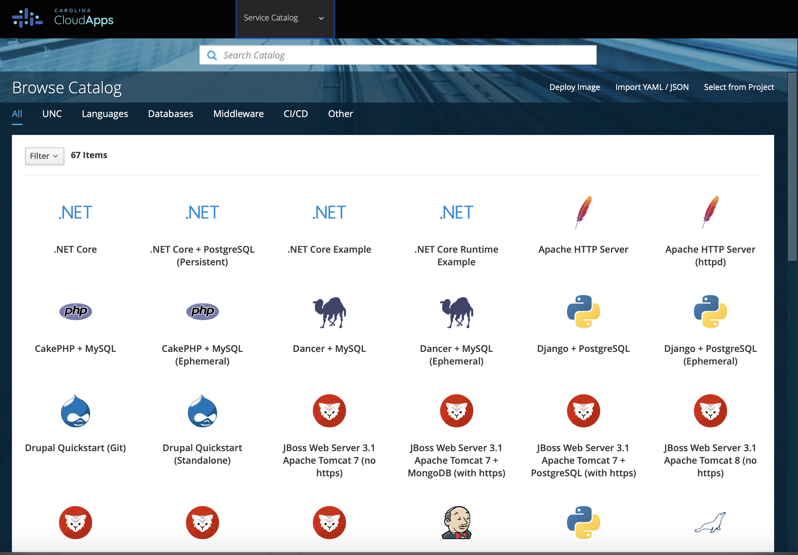
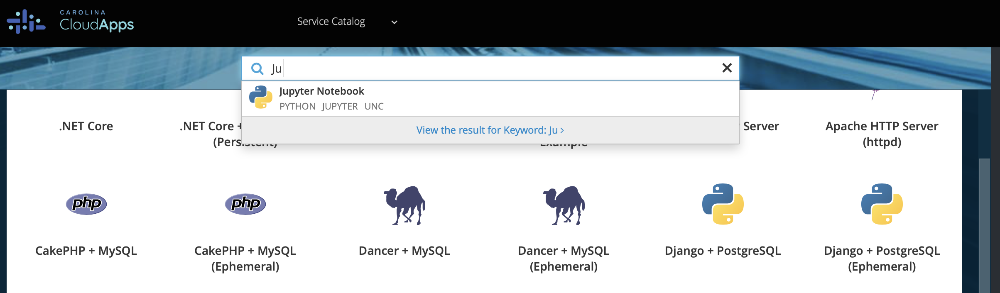
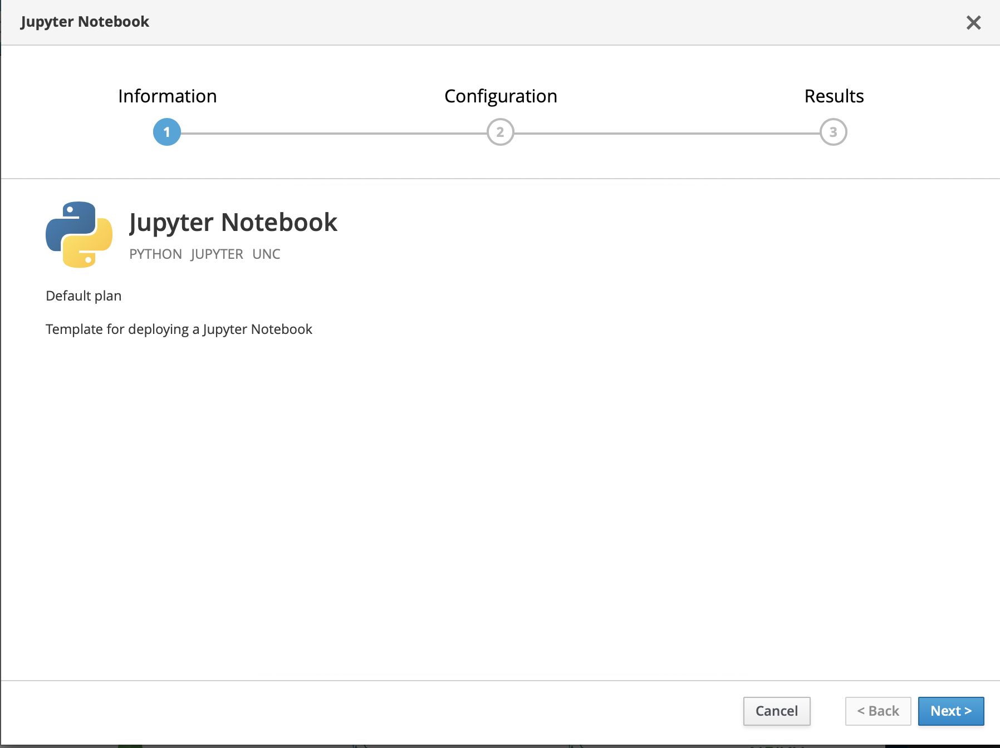
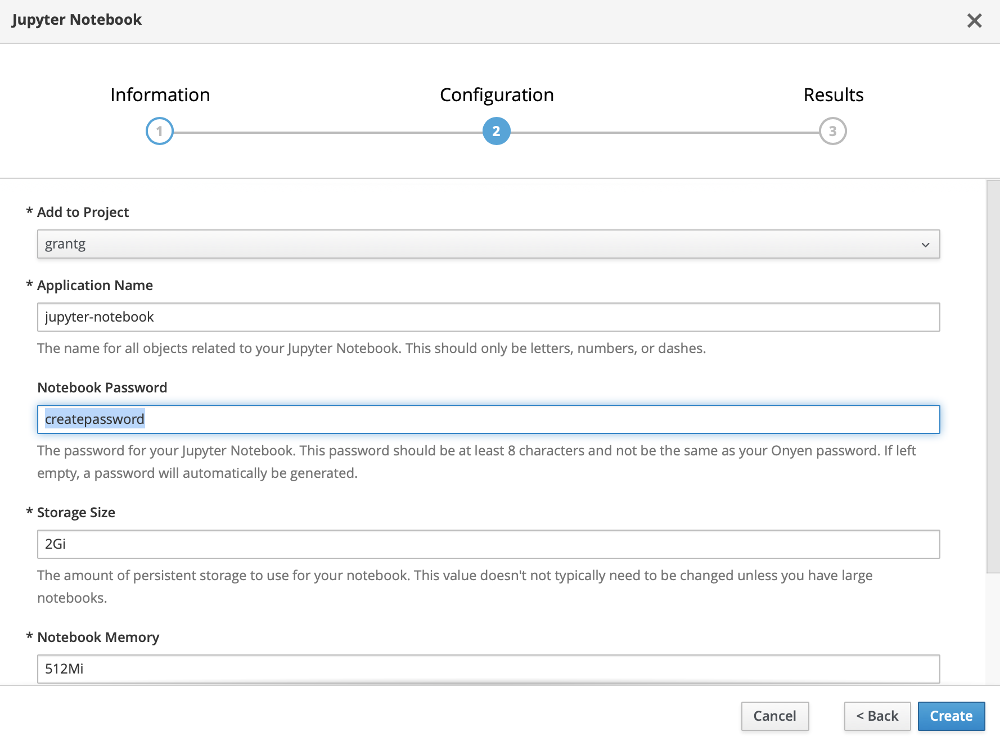
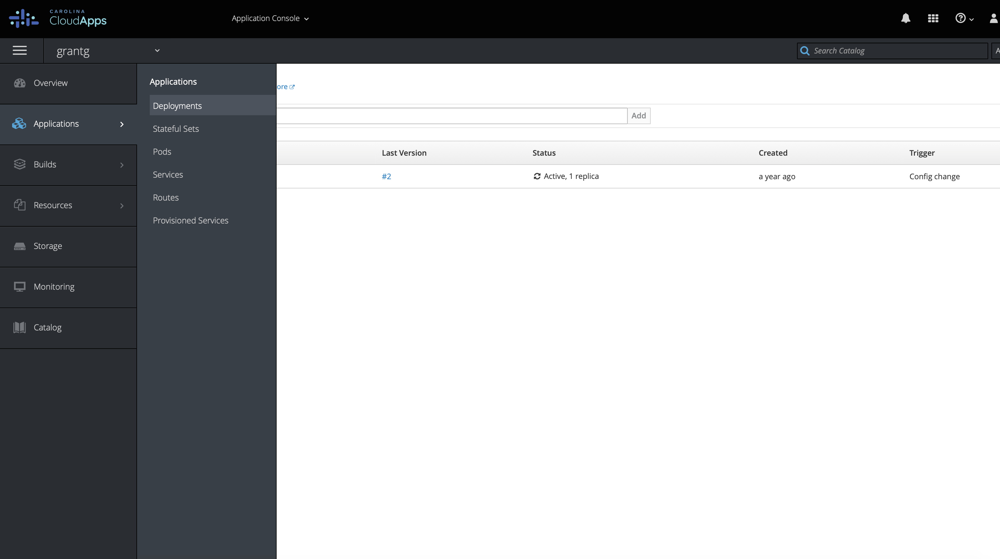
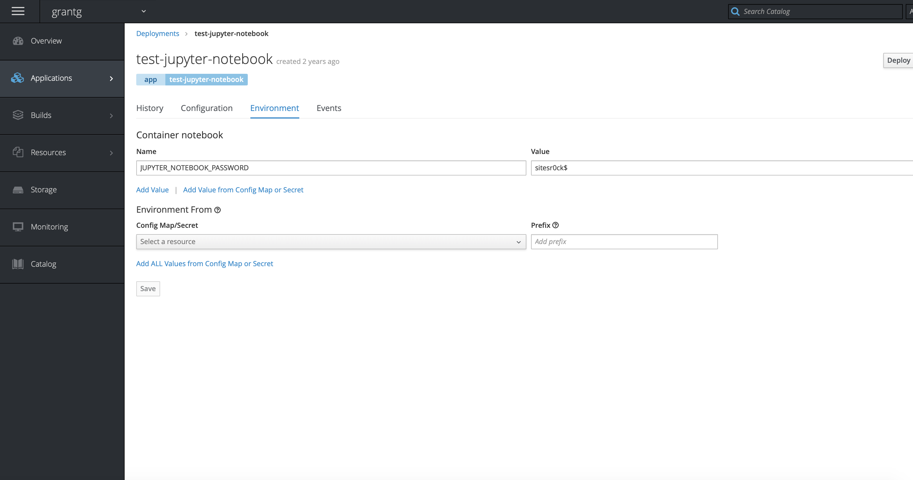
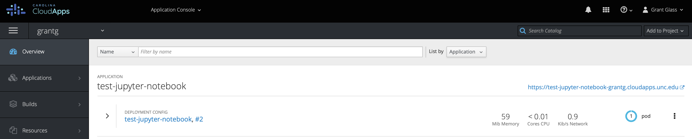
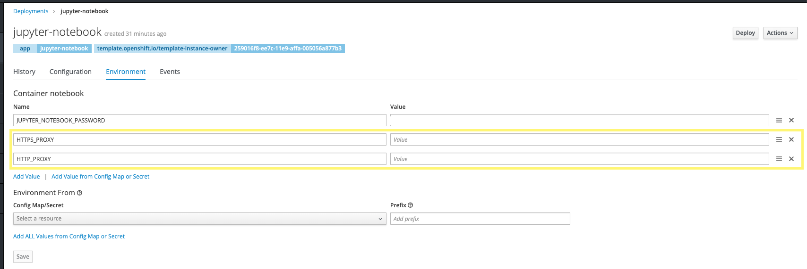

#Creating a Jupyter NoteBook using Carolina Cloud Apps

1. Go to [https://cloudapps.unc.edu](https://cloudapps.unc.edu)

2. Click "Sign Up" and Log in with Onyen.

3. Agree to Terms and Conditions and Finish Signing Up.

4. After you are finished, go back to [https://cloudapps.unc.edu](https://cloudapps.unc.edu)

5. Click "Sign In" and Log in with Onyen.

6. Find the Service Catalog under the dropdown at the top of the page.

7. Use the search bar and type in "Jupyter" You should see the Jupyter Notebook appear. Click on the Jupyter Notebook.

8. A pop-up window will appear. The first screen is "Info" Confirm that you see Jupyter Notebook and Click "Next"

9. The next screen will ask you to configure your Notebook. In the "Add to Project" dropdown, make sure that your Onyen shows up. Mine is "grantg"

10. Keep all the information the same, except enter in a password for your notebook--it cannot not be the same as your onyen. 

11. Click "Create"

12. It will take a few minutes to create.

13. If you forget your password, you can always find it by going to "Applications" on the lefthand menu, then select deployments.

14. After you click Deployments, you will see "jupyter-notebook" under name. Click on "jupyter-notebook"

15. Click on "Environment" next to "Configuration" on the menu in the center of the screen. 

16. You will see your password under "Value" If you want to change the password, type in a new one and press "Save"

17. And add "HTTP_PROXY" and "HTTPS_PROXY" environment variables with a blank value.

18. To access your Jupyter Notebook, click on "Overview" on the lefthand menu. You will see the url of your notebook in the right corner, usually it is https://juptyer-notebook.onyen.cloudapps.unc.edu

19. Click on that url and enter the password you made to access your notebook.
